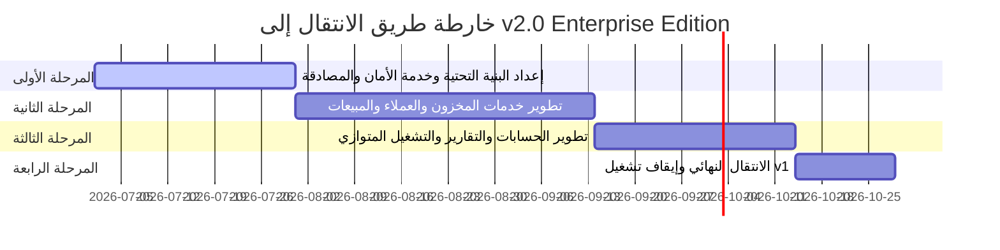

# هندسة النظام المعمارية للإصدار الجديد: v2.0 Enterprise Edition
## (ASP.NET Core Web API, PostgreSQL & Kubernetes)

يوضح هذا المستند التصميم الهيكلي والمخطط المعماري وخطة الانتقال للإصدار الجديد **v2.0 Enterprise Edition** لنظام إدارة معرض السيارات. يعتبر هذا الإصدار مشروعاً جديداً ومنفصلاً بالكامل، مع الإبقاء على الإصدار الحالي v1 كنسخة مستقرة دون أي تعديل أو مساس بسجلاتها.

---

## 1. هل يستحق الانتقال من Flask إلى .NET؟ (Architectural Justification)

نعم، الانتقال إلى بيئة العمل **ASP.NET Core (C#)** يعتبر استثماراً استراتيجياً للمؤسسات الكبرى (Enterprise) للأسباب الهندسية والتشغيلية التالية:

### أ. الأداء الفائق والإنتاجية العالية (Performance & Throughput)
* **سرعة المعالجة**: يتصدر إطار عمل ASP.NET Core منصات تطوير الويب في اختبارات الأداء العالمية (مثل TechEmpower) بفضل محرك التشغيل Kestrel، حيث يعتمد على نموذج برمجة غير متزامن (Asynchronous Programming) بالكامل ومتعدد الخيوط (Multi-threaded).
* **التغلب على قيود البايثون (GIL)**: يعاني إطار Flask في بايثون من قفل المفسر العام (Global Interpreter Lock - GIL)، مما يجعل المعالجة المتعددة الحقيقية مكلفة ومستهلكة للذاكرة. بينما في .NET، تتم إدارة الخيوط المتعددة بكفاءة عالية على مستوى نظام التشغيل والـ Runtime.

### ب. موثوقية الكود وصيانة الأنظمة الكبيرة (Type Safety & Maintainability)
* **لغة صارمة النوع (Strongly-Typed)**: يقلل استخدام لغة C# من الأخطاء البرمجية الشائعة أثناء وقت التشغيل (Runtime Errors) ويكتشفها أثناء وقت البناء (Compile-time).
* **بنية هندسية معيارية**: تفرض بيئة .NET أنماط تصميم نظيفة مثل (Clean Architecture / Onion Architecture) بشكل قياسي ومدمج، مما يسهل على المطورين العمل معاً على نفس الكود البرمجي دون تداخل وتسهيل صيانة النظام لسنوات طويلة.

### ج. دعم مدمج لاحتياجات المؤسسات الكبرى (Enterprise-Ready Features)
* **حقن التبعية المدمج (Dependency Injection)**: يأتي كجزء أساسي من إطار العمل دون الحاجة لمكتبات خارجية.
* **إطار الأمان والمصادقة (Identity Framework)**: يوفر حماية متكاملة ومجربة للتحقق من الهوية وصلاحيات الوصول القائمة على الأدوار والمطالبات (Role & Claim-Based Authorization).
* **الاتصال بالأنظمة الخارجية**: توافقية ممتازة ومكتبات ناصجة للربط مع أنظمة الـ ERP والـ CRM والبنوك والمحاسبة المعقدة.

---

## 2. مقارنة شاملة: النظام الحالي v1 مقابل النظام المقترح v2.0 Enterprise

| وجه المقارنة | النظام الحالي v1 (المستقر) | النظام المقترح v2.0 Enterprise |
| :--- | :--- | :--- |
| **هندسة النظام** | كتلة واحدة (Monolithic Architecture) | خدمات مصغرة / موجهة للخدمات (Microservices / SOA) |
| **لغة البرمجة وإطار عمل الخلفية** | Python / Flask | C# / ASP.NET Core Web API (NET 8/9) |
| **إدارة ومعالجة المهام** | متزامنة مع خيوط محدودة (Gunicorn) | غير متزامنة بالكامل (Asynchronous / Task-based) |
| **قاعدة البيانات** | قاعدة بيانات PostgreSQL واحدة مركزية | قواعد بيانات معزولة لكل خدمة (Database-per-Service) أو Schemas منفصلة |
| **إدارة الحاويات والتشغيل** | Docker Compose (بيئة خوادم فردية) | Kubernetes Pods & Deployments (توافرية عالية وقابلية توسع) |
| **البروكسي العكسي وتوجيه الطلبات** | Nginx كحاوية مستقلة | Kubernetes Ingress Controller (مثل Nginx Ingress or Traefik) |
| **إدارة الهوية والأمان** | JWT مخصص في Flask | خدمة هوية مستقلة (OAuth2 / OpenID Connect / Identity API) |
| **مراقبة الأداء وتسجيل السجلات** | ملفات سجلات محلية وتخزين JSON | مراقبة مركزية (Prometheus & Grafana) وسجلات مجمعة (Elastic/Loki) |
| **النسخ الاحتياطي** | سكربتات بايثون محلية دورية | خدمة نسخ احتياطي سحابي تلقائي متكاملة مع Kubernetes CronJobs |
| **التوسعية (Scaling)** | توسع رأسي يدوي (Vertical Scaling) | توسع أفقي تلقائي (Horizontal Pod Autoscaler - HPA) حسب استهلاك الـ CPU/RAM |

---

## 3. المخطط المعماري لنظام v2.0 (Architecture Diagram)

يوضح المخطط التالي بنية النظام المقترحة داخل عنقود Kubernetes (Kubernetes Cluster) وتدفق طلبات المستخدمين من خلال بوابة الدخول (Ingress) إلى الخدمات المختلفة وقواعد البيانات:

```mermaid
graph TD
    User([المستخدم / متصفح الويب / تطبيق الجوال]) -->|HTTPS / Port 443| Ingress[Kubernetes Ingress Controller]
    
    subgraph Kubernetes Cluster (Enterprise Namespace)
        Ingress -->|/api/auth/*| AuthSvc[Auth Service Pods]
        Ingress -->|/api/customers/*| CustSvc[Customers Service Pods]
        Ingress -->|/api/inventory/*| InvSvc[Inventory Service Pods]
        Ingress -->|/api/sales/*| SalesSvc[Sales Service Pods]
        Ingress -->|/api/purchases/*| PurSvc[Purchases Service Pods]
        Ingress -->|/api/accounting/*| AccSvc[Accounting Service Pods]
        Ingress -->|/api/reports/*| RepSvc[Reports Service Pods]
        Ingress -->|/* (Static UI)| Frontend[Next.js Frontend Pods]
        
        %% Database & Message Queue Linkage
        AuthSvc & CustSvc & InvSvc & SalesSvc & PurSvc & AccSvc & RepSvc -.->|Event Bus / Messaging| RabbitMQ[(RabbitMQ / Kafka Pods)]
        
        %% Database Connections
        AuthSvc --> DB-Auth[(Auth DB)]
        CustSvc --> DB-Cust[(Customers DB)]
        InvSvc --> DB-Inv[(Inventory DB)]
        SalesSvc & PurSvc & AccSvc --> DB-Core[(Core Enterprise DB)]
        
        %% Backup and Infrastructure services
        BackupJob[Backup Service CronJob] -.->|pg_dump & Backup Scripts| DB-Core & DB-Inv & DB-Cust & DB-Auth
        BackupJob -->|Upload Backups| CloudStorage[AWS S3 / Azure Blob Storage]
        
        %% Monitoring Stack
        Prometheus[Prometheus Service] -.->|Scrapes Metrics| AuthSvc & CustSvc & InvSvc & SalesSvc & AccSvc & Frontend
        Prometheus --> Grafana[Grafana Dashboard]
    end

    subgraph Persistent Storage (PVC)
        DB-Core --- Core-PV[(PV: Enterprise DB Data)]
        CustSvc --- Cust-Docs-PV[(PV: Secured Customer Documents)]
    end

    classDef service fill:#d4ebf2,stroke:#005c8a,stroke-width:2px;
    classDef database fill:#dbf2d4,stroke:#2b6e14,stroke-width:2px;
    classDef infra fill:#f2d4d4,stroke:#8a0000,stroke-width:1px;
    
    class AuthSvc,CustSvc,InvSvc,SalesSvc,PurSvc,AccSvc,RepSvc,Frontend service;
    class DB-Auth,DB-Cust,DB-Inv,DB-Core database;
    class Ingress,RabbitMQ,BackupJob,Prometheus,Grafana,CloudStorage,Core-PV,Cust-Docs-PV infra;
```

---

## 4. تقسيم الخدمات (Microservices / Service-Oriented Breakdown)

لتحقيق أقصى درجات التوافرية وتسهيل الصيانة، يتم تقسيم نظام v2.0 إلى الخدمات المستقلة التالية:

### 1. خدمة المصادقة والأمان (Auth Service)
* **الوظيفة الرئيسية**: التحقق من هوية المستخدمين، إدارة كلمات المرور، توليد وتجديد رموز JWT، وإدارة الصلاحيات (Roles/Permissions).
* **التقنية**: ASP.NET Core Identity API مع JWT Bearer Authentication.
* **البيانات**: جداول المستخدمين والأدوار وجلسات النشاط الفعالة.

### 2. خدمة العملاء (Customers Service)
* **الوظيفة الرئيسية**: إدارة السجلات الكاملة للعملاء، وتخزين وثائق الهويات والعقود بشكل آمن للغاية.
* **التقنية**: ASP.NET Core Web API متصلة بمجلد تخزين محمي.
* **البيانات**: بيانات العميل الشخصية، وثائق الهوية المرفوعة (تُخزن في PVC مشفر).

### 3. خدمة المخزون (Inventory Service)
* **الوظيفة الرئيسية**: إدارة السيارات المتوفرة بالمعرض، تفاصيل المواصفات، الفئات، الصور العامة للسيارات، وحالة توافر السيارة (متاحة، محجوزة، مباعة).
* **التقنية**: ASP.NET Core Web API مع تكامل مع Redis لتخزين بيانات البحث المؤقتة.
* **البيانات**: مواصفات السيارات، أسعار المعروض، الصور المرفوعة العامة.

### 4. خدمة المبيعات (Sales Service)
* **الوظيفة الرئيسية**: إدارة طلبات الشراء من العملاء، إعداد عقود البيع، حساب الأقساط الشهرية، وتتبع عمليات الدفع.
* **التقنية**: ASP.NET Core Web API مع تطبيق نمط Saga لإدارة المعاملات الموزعة مع خدمة الحسابات.
* **البيانات**: عقود المبيعات، خطط التقسيط، الفواتير الصادرة للعملاء.

### 5. خدمة المشتريات (Purchases Service)
* **الوظيفة الرئيسية**: تسجيل شراء سيارات جديدة من الموردين، وإدارة تكاليف الاستيراد أو الشراء وتحديث حالة المخزون.
* **التقنية**: ASP.NET Core Web API.
* **البيانات**: فواتير الشراء، بيانات الموردين، تكاليف شحن وصيانة السيارات الواردة.

### 6. خدمة الحسابات والمالية (Accounting Service)
* **الوظيفة الرئيسية**: إدارة شجرة الحسابات (Chart of Accounts)، القيود اليومية التلقائية (General Ledger Journals) الناتجة عن عمليات البيع والشراء، وإعداد التقارير المحاسبية.
* **تحذير أمني وتدقيقي**: **يُمنع تماماً تحت أي ظرف تعديل أو حذف أي قيد مالي مسجل**. يتم إجراء التعديلات حصرياً عبر قيود تسوية عكسية (Adjustment/Reverse Journals).
* **التقنية**: ASP.NET Core Web API مع تطبيق بنية Event Sourcing لضمان عدم إمكانية تعديل السجل التاريخي للحسابات المالي.

### 7. خدمة التقارير ولوحات البيانات (Reports Service)
* **الوظيفة الرئيسية**: تجميع البيانات وإعداد تقارير بيانية وإحصائية معقدة (مثل الميزانية العمومية، تقارير الأرباح والخسائر، ومعدل دوران المخزون) دون التأثير على أداء الخدمات الحية.
* **التقنية**: ASP.NET Core متصلة بقاعدة بيانات قراءة فقط (Read Replica) لتحقيق نمط CQRS (فصل الاستعلام عن الكتابة).

### 8. خدمة النسخ الاحتياطي وإدارة الكوارث (Backup Service)
* **الوظيفة الرئيسية**: أتمتة عملية أخذ النسخ الاحتياطية الدورية لقواعد البيانات والملفات المرفوعة، تشفيرها، ورفعها لخوادم تخزين سحابي آمنة، بالإضافة إلى اختبار استعادتها تلقائياً.
* **التقنية**: Kubernetes CronJob يشغل حاوية مخصصة تحتوي على أدوات PostgreSQL Client وأدوات التشفير والاتصال السحابي (AWS CLI / Azure CLI).

---

## 5. خطة ترحيل البيانات والنظام (Migration Plan)

للانتقال من نظام Flask v1 إلى .NET v2.0 دون أي انقطاع في الخدمة (Zero-Downtime Migration)، نتبع نمط **Strangler Fig Pattern**:

```
+-------------------------------------------------------------------+
|                     Ingress / API Gateway                         |
+-------------------------------------------------------------------+
           |                                             |
           | (طلب مسار تم ترحيله)                           | (طلب مسار قديم)
           v                                             v
+-----------------------------+               +---------------------+
|  .NET v2.0 (Microservices)  |               |   Flask v1 (Legacy) |
+-----------------------------+               +---------------------+
           |                                             |
           v (مزامنة البيانات / CDC)                      v
+-----------------------------+               +---------------------+
|      PostgreSQL v2 DB       | <===========> |   PostgreSQL v1 DB  |
+-----------------------------+               +---------------------+
```

### خطوات الترحيل التفصيلية:

1. **الخطوة الأولى: إعداد بوابة API الموحدة (Ingress / API Gateway)**
   * نوجه حركة المرور بالكامل من خلال Ingress. في البداية، يتم تحويل 100% من الطلبات إلى نظام Flask v1 الحالي.

2. **الخطوة الثانية: بناء وتثبيت نظام v2 المتوازي**
   * نقوم بتشغيل البنية التحتية لنظام v2 (عنقود Kubernetes وقاعدة البيانات الجديدة PostgreSQL v2).

3. **الخطوة الثالثة: ترحيل قاعدة البيانات ومزامنتها (Database Sync & CDC)**
   * نستخدم أداة تتبع تغير البيانات (Change Data Capture) مثل **Debezium** أو إعداد تكرار منطقي للبيانات (Logical Replication) في PostgreSQL لنقل البيانات الحية بشكل مستمر ولحظي من قاعدة بيانات v1 إلى قاعدة بيانات v2.

4. **الخطوة الرابعة: نقل الخدمات تدريجياً (Feature-by-Feature Migration)**
   * نبدأ بنقل الخدمات الأقل خطورة وتأثيراً. مثلاً: خدمة المخزون (Inventory Service).
   * نقوم بتحديث إعدادات Ingress لتوجيه مسار `/api/inventory/*` إلى خدمة .NET الجديدة، بينما تظل بقية الطلبات تذهب إلى Flask.
   * نكرر العملية للخدمات الأخرى: العملاء -> المشتريات -> المبيعات -> الحسابات.

5. **الخطوة الخامسة: التشغيل المتوازي وظل البيانات (Shadow Running)**
   * يتم تشغيل النظامين معاً لفترة (مثلاً أسبوعين)، حيث يتم تكرار طلبات الكتابة على النظامين ومقارنة النتائج والتقارير المالية لضمان تطابق البيانات التام وخلو نظام v2 من الأخطاء.

6. **الخطوة السادسة: الإيقاف النهائي لنظام v1 (Decommissioning)**
   * بعد التأكد من استقرار نظام v2 بالكامل، يتم تحويل حركة المرور بنسبة 100% إليه، وإلغاء تفعيل حاويات نظام v1 وحفظ نسخته الاحتياطية الأخيرة كأرشيف تاريخي مغلق.

---

## 6. تصميم صور الحاويات (Docker Images Design)

يتم تصميم صور الحاويات لخدمات .NET والواجهة الأمامية باستخدام البناء متعدد المراحل (Multi-stage Build) لضمان أعلى مستويات الأمان وتقليل مساحة الصور لأقل حد ممكن.

### أ. Dockerfile لخدمات ASP.NET Core Web API (مثال عام)

```dockerfile
# 1. مرحلة بناء الكود (Build Stage)
FROM mcr.microsoft.com/dotnet/sdk:8.0-alpine AS build
WORKDIR /src

# نسخ ملفات المشروع واستعادة الاعتمادات لتسريع التخزين المؤقت (Caching)
COPY ["Enterprise.Showroom.Api/Enterprise.Showroom.Api.csproj", "Enterprise.Showroom.Api/"]
RUN dotnet restore "Enterprise.Showroom.Api/Enterprise.Showroom.Api.csproj"

# نسخ باقي ملفات الكود وبناء التطبيق بصيغة الإنتاج
COPY . .
WORKDIR "/src/Enterprise.Showroom.Api"
RUN dotnet build "Enterprise.Showroom.Api.csproj" -c Release -o /app/build

# 2. مرحلة النشر (Publish Stage)
FROM build AS publish
RUN dotnet publish "Enterprise.Showroom.Api.csproj" -c Release -o /app/publish /p:UseAppHost=false

# 3. مرحلة التشغيل النهائية (Runtime Stage)
FROM mcr.microsoft.com/dotnet/aspnet:8.0-alpine AS final
WORKDIR /app

# إنشاء مستخدم غير مسؤول أمنياً داخل الحاوية لعدم التشغيل بصلاحيات Root
RUN addgroup -g 10001 -S appgroup && \
    adduser -u 10001 -S appuser -G appgroup
USER appuser

# نسخ الملفات المبنية فقط من المرحلة السابقة
COPY --from=publish /app/publish .

# ضبط البيئة والمنفذ الآمن للتشغيل
ENV ASPNETCORE_URLS=http://+:8080
ENV ASPNETCORE_ENVIRONMENT=Production
EXPOSE 8080

ENTRYPOINT ["dotnet", "Enterprise.Showroom.Api.dll"]
```

### ب. Dockerfile لواجهة Next.js الأمامية (محسنة لبيئة الإنتاج)

```dockerfile
# 1. مرحلة تثبيت الاعتمادات
FROM node:20-alpine AS deps
WORKDIR /app
COPY package.json package-lock.json ./
RUN npm ci

# 2. مرحلة بناء الواجهة
FROM node:20-alpine AS builder
WORKDIR /app
COPY --from=deps /app/node_modules ./node_modules
COPY . .
ENV NEXT_TELEMETRY_DISABLED 1
RUN npm run build

# 3. مرحلة التشغيل (Production Stage)
FROM node:20-alpine AS runner
WORKDIR /app
ENV NODE_ENV production
ENV NEXT_TELEMETRY_DISABLED 1

# إنشاء مستخدم آمن لتشغيل الحاوية
RUN addgroup --system --gid 1001 nodejs && \
    adduser --system --uid 1001 nextjs

# نسخ الملفات اللازمة للتشغيل المستقل فقط
COPY --from=builder /app/public ./public
COPY --from=builder --chown=nextjs:nodejs /app/.next/standalone ./
COPY --from=builder --chown=nextjs:nodejs /app/.next/static ./.next/static

USER nextjs
EXPOSE 3000
ENV PORT 3000
ENV HOSTNAME "0.0.0.0"

CMD ["node", "server.js"]
```

---

## 7. تصميم Kubernetes (K8s Configuration Design)

نقوم بتصميم هيكلية Kubernetes لتنظيم الموارد وعزلها بطريقة احترافية:

```
+--------------------------------------------------------------------------------------+
| K8s Namespace: showroom-enterprise                                                   |
|                                                                                      |
|  +--------------------------------------------------------------------------------+  |
|  | Ingress Rule (SSL Terminated) -> /api/accounting -> Service: accounting-service|  |
|  +--------------------------------------------------------------------------------+  |
|                                                                                      |
|   +-----------------------+      +-----------------------+     +------------------+  |
|   | Pods: accounting-app  | <--> | Service: ClusterIP    | <-> | Secret/ConfigMap |  |
|   | (ReplicaSet: 3 Pods)  |      | Port: 80              |     | DB Credentials   |  |
|   +-----------------------+      +-----------------------+     +------------------+  |
|               |                                                                      |
|               v                                                                      |
|   +-----------------------+      +-----------------------+                           |
|   | StatefulSet: pg-db    | <--> | PersistentVolumeClaim |                           |
|   | (Primary/Replica)     |      | (StorageClass: SSD)   |                           |
|   +-----------------------+      +-----------------------+                           |
+--------------------------------------------------------------------------------------+
```

### أ. Deployments (نشر التطبيقات)
* إنشاء Deployment مستقل لكل خدمة مصغرة (مثل `accounting-deployment` و `inventory-deployment`).
* ضبط خيار التحديث التدريجي:
  ```yaml
  strategy:
    type: RollingUpdate
    rollingUpdate:
      maxSurge: 1       # إنشاء حاوية جديدة قبل حذف القديمة
      maxUnavailable: 0 # لا يتم إيقاف أي حاوية أثناء التحديث لضمان توفر الخدمة 100%
  ```

### ب. Pods Specification (مواصفات الحاويات)
* ضبط حدود الموارد (Resource Limits) لحماية العنقود من تسريب الذاكرة:
  ```yaml
  resources:
    limits:
      cpu: "1"
      memory: 1Gi
    requests:
      cpu: "250m"
      memory: 512Mi
  ```
* تفعيل فحوصات الجاهزية والسلامة:
  * **Liveness Probe**: للتحقق من أن التطبيق يعمل بشكل طبيعي وإعادة تشغيله تلقائياً عند حدوث تجميد للكود.
  * **Readiness Probe**: للتحقق من جاهزية الخدمة لاستقبال طلبات المستخدمين (مثال: فحص مسار `/healthz`).

### ج. Services (ربط الشبكات الداخلية)
* استخدام نوع **ClusterIP** لجميع خدمات الخلفية وقاعدة البيانات لعزلها تماماً ومنع وصول الإنترنت الخارجي إليها.
* استخدام الخدمة فقط للتواصل الداخلي بين الحاويات عبر أسماء النطاقات الداخلية للـ Cluster (مثال: `http://accounting-service:80`).

### د. Ingress (توجيه الطلبات الخارجية)
* إعداد قواعد Ingress لتوجيه الطلبات بناءً على المسار (Path-based Routing):
  * توجيه `/api/auth/*` لخدمة `auth-service`.
  * توجيه `/api/accounting/*` لخدمة `accounting-service`.
  * توجيه `/` لخدمة الواجهة الأمامية `frontend-service`.
* ربط شهادات الـ SSL من خلال Ingress باستخدام **cert-manager** لأتمتة تجديد شهادات Let's Encrypt مجاناً.

### هـ. ConfigMaps & Secrets (إدارة الإعدادات والبيانات الحساسة)
* **ConfigMaps**: لتخزين الإعدادات العامة غير الحساسة مثل عناوين الخدمات الخارجية، وإعدادات التسجيل ومستويات الأخطاء (Logging Levels).
* **Secrets**: لتخزين كلمات المرور لقواعد البيانات، ومفاتيح تشفير الـ JWT، وبيانات الاتصال بالـ API الخارجية. تُخزن مشفرة (at rest) ويتم حقنها كمتغيرات بيئة داخل الحاويات أثناء التشغيل.

### و. Persistent Volumes (PV) & Claims (PVC)
* استخدام **StorageClass** بنوع SSD سريع (مثل AWS `gp3` أو Azure `managed-csi`) لقاعدة البيانات وملفات الوثائق الحساسة.
* ربط قواعد البيانات بـ **StatefulSets** بدلاً من Deployments العادية لضمان ثبات اسم الـ Pod والـ Volume المرتبط به حتى بعد إعادة التشغيل.

---

## 8. خطة قاعدة البيانات PostgreSQL (Enterprise Database Strategy)

### أ. هيكلية قواعد البيانات (Database Isolation)
لضمان استقلالية الخدمات وتجنب مشاكل الاعتماديات المشتركة، نطبق مبدأ **Schema-per-Service** كحل وسط ممتاز للشركات المتوسطة والكبرى:
* يتم إنشاء قاعدة بيانات واحدة مركزية ذات مواصفات عالية، وتُقسم داخلياً إلى Schemas منفصلة:
  * `auth_schema`: للمستخدمين والأذونات.
  * `inventory_schema`: للمخزون والسيارات.
  * `accounting_schema`: للقيود والحسابات المالية.
  * `sales_schema`: للمبيعات والأقساط.
* يُمنح كل مستخدم قاعدة بيانات صلاحية الوصول فقط إلى الـ Schema الخاصة بخدمته، وممنوع الاستعلام المباشر (Cross-Schema Queries) بين الخدمات؛ ويتم تبادل البيانات حصرياً عبر الـ API أو الـ Event Bus.

### ب. توافرية قواعد البيانات العالية (High Availability & Replication)
* إعداد بنية **Primary / Replica**:
  * عقدة أساسية (Primary Pod) مخصصة لعمليات الكتابة (Writes).
  * عقدة أو أكثر فرعية (Replica Pods) مخصصة لعمليات القراءة (Reads) وتوليد التقارير.
* استخدام مشغلات Kubernetes مخصصة لإدارة قواعد البيانات مثل **CloudNativePG** للتعامل التلقائي مع حالات الفشل (Failover) وتكرار البيانات بدون تدخل بشري.

### ج. ترحيل قاعدة البيانات (Database Migrations)
* استخدام أداة **Entity Framework Core Migrations** لإدارة هيكل الجداول برمجياً.
* تشغيل عمليات الترحيل (Migrations) كـ **Kubernetes Jobs** مستقلة تعمل قبل عملية نشر الخدمة (Pre-deployment Job) لضمان تحديث الجداول قبل تشغيل الأكواد الجديدة.

---

## 9. خطة الاختبارات المتكاملة (Testing Strategy)

لضمان جودة البرمجيات وخلوها من الأخطاء في بيئة المؤسسات الكبرى، نعتمد على الهرم القياسي للاختبارات:

```
      / \
     /   \     End-to-End Tests (Playwright) - 10%
    / E2E \
   /-------\
  /  Inte-  \  Integration Tests (Testcontainers) - 30%
 /  gration  \
/-------------\
/    Unit     \ Unit Tests (xUnit, Moq) - 60%
/_____________\
```

### أ. اختبارات الوحدة (Unit Tests)
* **التقنية**: مكتبة **xUnit** مع **Moq** للمحاكاة الافتراضية للخدمات الخارجية.
* **الهدف**: اختبار منطق الأعمال الداخلي (Business Logic) وحسابات الأقساط والعمليات الحسابية بنسبة تغطية كود (Code Coverage) لا تقل عن 80%.

### ب. اختبارات التكامل (Integration Tests)
* **التقنية**: استخدام **Testcontainers for .NET** لتشغيل حاوية PostgreSQL حقيقية مؤقتة أثناء تشغيل الاختبارات للتأكد من صحة الاستعلامات وعمليات الحفظ.
* **الهدف**: التحقق من تكامل الكود مع قاعدة البيانات والـ API والخدمات الأخرى بشكل واقعي.

### ج. اختبارات النظام الشاملة (E2E & Load Testing)
* **اختبارات الواجهة**: استخدام **Playwright** لأتمتة اختبار مسارات المستخدمين الحيوية (مثال: تسجيل دخول العميل -> اختيار سيارة -> إنشاء عقد بيع -> توليد القيد المحاسبي).
* **اختبارات الحمل والأداء**: استخدام أداة **k6** لاختبار تحمل النظام للطلبات المتزامنة الكثيفة وضمان استجابة النظام تحت الضغط.

---

## 10. خطة التطوير والتكامل المستمر (CI/CD Pipeline)

تعتمد خطة الـ CI/CD على أتمتة البناء والفحص الأمني والرفع والترقية السريعة من خلال الأدوات الحديثة:

```
[كتابة الكود ومزامنته] 
        |
        v
+------------------+
| CI: GitHub       | 1. فحص الكود (Linting / SonarQube)
| Actions          | 2. تشغيل اختبارات الوحدة والتكامل
|                  | 3. بناء صور Docker والرفع إلى Container Registry
+------------------+
        |
        v
+------------------+
| CD: GitOps       | 1. تحديث مستودع الإعدادات (Helm Charts)
| (ArgoCD / Helm)  | 2. تطبيق التغييرات تلقائياً على K8s Cluster
|                  | 3. التحقق من سلامة التشغيل (Health Checks)
+------------------+
```

### أ. التكامل المستمر (CI Pipeline)
1. **الزناد (Trigger)**: يعمل تلقائياً عند إرسال كود جديد (Push) أو فتح طلب سحب (Pull Request) إلى الفرع الرئيسي `main`.
2. **فحص جودة الكود (Static Code Analysis)**: تشغيل `dotnet format` وفحص الأمان عبر أداة **SonarQube** لاكتشاف الثغرات وتكرار الكود.
3. **البناء والاختبار (Build & Test)**: تشغيل اختبارات الوحدة والتكامل والتأكد من نجاح بناء المشروع.
4. **بناء ورفع الحاويات (Docker Build & Push)**: بناء صور Docker لكل خدمة ووسمها برقم الإصدار المحدث (Tagging) ثم رفعها إلى مستودع الصور الخاص بالمؤسسة (مثل AWS ECR أو Docker Hub Enterprise).

### ب. النشر المستمر (CD Pipeline)
* نعتمد على مبدأ الـ **GitOps** باستخدام أداة **ArgoCD** أو تطبيق خطة نشر باستخدام **Helm Charts**:
  * يتم تخزين ملفات إعداد Kubernetes في مستودع Git خاص بالإعدادات (Infrastructure as Code).
  * يقوم ArgoCD بمراقبة المستودع وعند وجود أي تغيير في إعدادات الخدمة أو وسم الصورة، يقوم بتطبيق التعديلات تلقائياً على عنقود Kubernetes لتتطابق حالة العنقود مع مستودع الـ Git.
  * في حال حدوث أي فشل بعد النشر، يتيح النظام إمكانية التراجع الفوري (Rollback) للإصدار السابق بضغطة زر واحدة.

---

## 11. إدارة المخاطر والتكلفة (Risk & Cost Management)

### أ. المخاطر والحلول المقترحة

| الخطر المتوقع | تأثير الخطر | خطة التخفيف والحل البديل |
| :--- | :--- | :--- |
| **فقدان البيانات أثناء الهجرة** | حرج جداً | تشغيل نظام تكرار البيانات CDC ولزوم تطابق الأرصدة المالية بنسبة 100% في التشغيل المتوازي قبل الإيقاف الفعلي لنظام v1. |
| **منحنى التعلم للفريق البرمجي** | متوسط | تدريب الفريق الحالي على لغة C# ومبادئ Kubernetes، أو الاستعانة بمستشار تقني لتأسيس البنية التحتية وتسليمها للفريق. |
| **تعطل النظام القديم أثناء العمل** | حرج | عزل كامل لبيئة التطوير والتشغيل لنظام v2 عن بيئة v1، بحيث لا يتشاركان أي موارد أو خوادم إلا بوابة Ingress. |
| **تضخم تكاليف الحوسبة السحابية** | متوسط | استخدام الحوسبة الهجينة أو البدء بعنقود Kubernetes صغير الحجم وتطبيق سياسة Auto-scaling لإيقاف تشغيل الموارد غير المستخدمة ليلاً. |

### ب. تقدير التكلفة التشغيلية المتوقعة (تقدير تقريبي شهري)
* **عنقود Kubernetes المدار (مثال AWS EKS)**: حوالي $73 شهرياً لإدارة العنقود + تكلفة عقد العمل (Worker Nodes - مثلاً 3 خوادم t3.medium) بحوالي $110 شهرياً.
* **قاعدة بيانات PostgreSQL المدارة (RDS High Availability)**: حوالي $120 شهرياً (مع النسخ الاحتياطي ومساحة التخزين الـ SSD).
* **خدمات المراقبة والتخزين السحابي للنسخ الاحتياطي**: حوالي $50 شهرياً.
* **الإجمالي التقريبي لتشغيل بيئة الإنتاج**: **$350 إلى $450 شهرياً** (قابلة للتحسين والتقليل في حال استخدام خوادم مخصصة Bare Metal باستخدام MicroK8s أو K3s).

---

## 12. خارطة طريق المشروع (Roadmap - 4 Phases)

تم تقسيم خطة العمل إلى 4 مراحل متتالية لضمان النشر السليم والآمن:



### المرحلة الأولى: تأسيس البنية التحتية والأمان (التجهيز الهيكلي)
* **المدة المتوقعة**: 4 أسابيع.
* **المخرجات**:
  * بناء البنية التحتية الأساسية لعنقود Kubernetes محلياً أو سحابياً.
  * تصميم وإعداد مستودعات الأكواد الجديدة لكل خدمة.
  * بناء وتشغيل **Auth Service** بالكامل لتهيئة إدارة المستخدمين والصلاحيات.
  * إعداد خطة CI/CD لبناء ورفع الصور البرمجية آلياً.

### المرحلة الثانية: تطوير الخدمات الأساسية والواجهات (تأسيس المحرك)
* **المدة المتوقعة**: 6 أسابيع.
* **المخرجات**:
  * تطوير **Customers Service** و **Inventory Service** و **Purchases Service** بالكامل بلغة C#.
  * تحديث وتطوير الواجهة الأمامية **Next.js** لتتوافق مع نقاط النهاية الجديدة (API Endpoints).
  * إعداد قواعد بيانات الـ PostgreSQL والـ Schemas المناسبة لها.

### المرحلة الثالثة: العمليات المالية والتشغيل المتوازي (الاختبار الواقعي)
* **المدة المتوقعة**: 4 أسابيع.
* **المخرجات**:
  * تطوير **Sales Service** و **Accounting Service** و **Reports Service** (مع التحقق الصارم من حماية وعدم تعديل السجلات المالية التاريخية).
  * تفعيل نظام تكرار البيانات (Logical Replication) لنقل البيانات الحية من قاعدة بيانات v1 إلى v2.
  * بدء التشغيل المتوازي الفعلي (Parallel Run) للنظامين معاً والتحقق من صحة ومطابقة كافة التقارير والحسابات.

### المرحلة الرابعة: النقل الكامل والاستقرار (الانطلاق النهائي)
* **المدة المتوقعة**: أسبوعين.
* **المخرجات**:
  * توجيه 100% من حركة مرور المستخدمين إلى النظام الجديد v2.0 Enterprise.
  * تفعيل **Backup Service** التلقائية السحابية والتحقق من سلامة استعادة البيانات.
  * إيقاف تشغيل خوادم نظام v1 وحفظ نسخته كمرجع تاريخي مؤرشف.
  * تسليم النظام بالكامل مع وثائق التشغيل وتدريب موظفي الدعم الفني.
