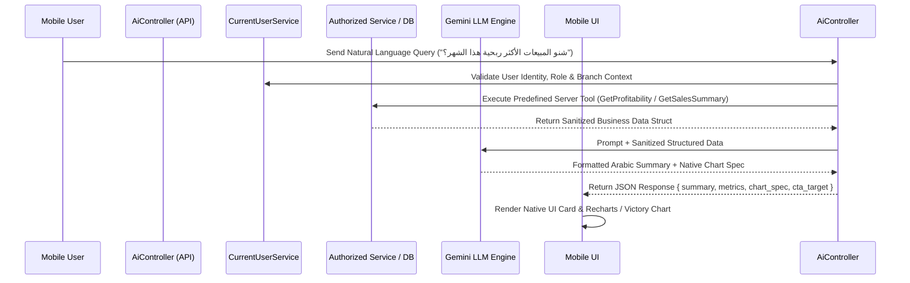

# AI_ARCHITECTURE.md — Enterprise AI Decision Support & Analytics Architecture

## 1. Vision & Overview

The AI Assistant in **شركة الأصدقاء لتجارة السيارات** is designed as a **Tool-Calling Business Assistant & Predictive Analytics Engine**.

It operates as an intelligent decision support layer over authorized business services. The LLM does NOT generate raw financial facts from memory nor write arbitrary SQL against the database.

---

## 2. Architecture & Data Flow



---

## 3. Server-Side Business Tools Catalog

The AI Assistant queries application data through the following server-side business tools inside `AiController.cs`:

1. `GetDashboardSummary`: Returns branch inventory counts, monthly sales revenue, and overdue stats.
2. `SearchInventory`: Performs safe parameterized search on available vehicle stock.
3. `GetInventorySummary`: Aggregate count of stock by status (`Available`, `Sold`, `Reserved`).
4. `GetSalesSummary`: Total sales revenue, active/cancelled contract counts, and top 5 selling brands.
5. `GetProfitability`: Net profit and margin percentage (Restricted to `Owner`, `Admin`, `Accountant`).
6. `GetOverdueInstallments`: Overdue installment counts, total outstanding debt, and defaulting customer counts.
7. `SearchCustomer`: Search customers by name or phone returning non-sensitive metadata.

---

## 4. AI Credit Risk Scoring Model (Decision Support)

The system provides an **Explainable Rules-Based Credit Risk Score (0 - 100)** for installment contracts.

### Scoring Factors Matrix
- **Down Payment Ratio** (< 20% = +25 Risk; 20-40% = +10 Risk; > 40% = 0 Risk)
- **Installment-to-Income Ratio** (> 40% = +20 Risk)
- **Customer History**:
  - Previous Completed Contracts (-15 Risk Reduction)
  - Existing Active Overdue Installments (+30 Risk Increase)
  - Average Past Payment Delay Days (> 15 Days = +15 Risk)

### Risk Classification Output
- **Low Risk (0 - 35)**: Approved for standard processing.
- **Medium Risk (36 - 65)**: Requires additional guarantor or 30%+ down payment.
- **High Risk (66 - 100)**: Requires Executive / Owner manual approval.

---

## 5. AI Dynamic Price Optimizer

Calculates target vehicle selling prices (`TargetSellingPrice`) and expected days in stock based on internal operational metrics:

$$\text{RecommendedPrice} = \text{PurchaseCost} + \text{CustomDuties} + \text{MaintenanceCost} + \text{TargetMargin}$$

Adjustments:
- **Inventory Age Penalty**: If Days in Stock > 60, apply a 2.5% margin reduction to accelerate turnover.
- **Model Historical Turnover**: Adjust price range based on average historical sale duration for similar brand/model.

---

## 6. AI Native Output Format

The `AiController` returns structured JSON responses enabling native rendering on mobile without webviews or rendered image LLM outputs:

```json
{
  "summary": "إجمالي المبيعات لشهر أيلول بلغ 142,500,000 د.ع بتحسن بنسبة 14% مقارنة بالشهر السابق.",
  "metrics": [
    { "label": "إجمالي المبيعات", "value": "142,500,000 د.ع", "type": "currency" },
    { "label": "السيارات المباعة", "value": "6 سيارات", "type": "number" }
  ],
  "chart_spec": {
    "type": "bar",
    "x_axis": "الموديل",
    "y_axis": "المبيعات",
    "data": [
      { "label": "Toyota Land Cruiser", "value": 68000000 },
      { "label": "Hyundai Elantra", "value": 32000000 }
    ]
  },
  "cta_target": "/sales"
}
```
