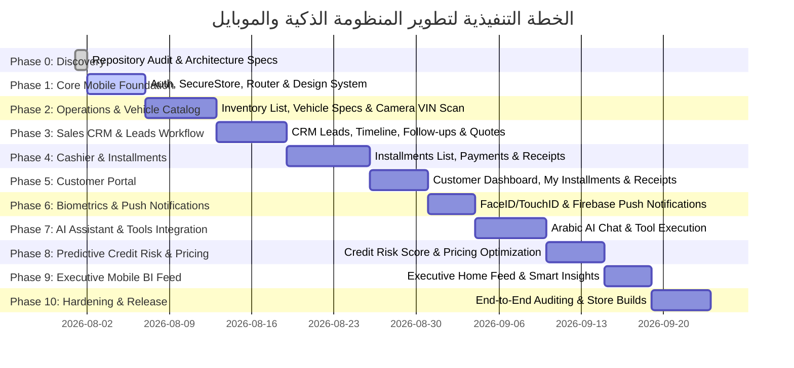

# MOBILE_IMPLEMENTATION_ROADMAP.md — Phased Implementation Roadmap

## 1. Overview & Strategy

This document outlines the phased implementation roadmap for the **Enterprise Mobile Application Suite** of **شركة الأصدقاء لتجارة السيارات** (`v2-enterprise`).

To ensure total system stability, financial integrity, and zero regression, implementation is organized into **10 strict, incremental phases**.

---

## 2. Implementation Phases Breakdown

---

## 3. Detailed Phase Objectives & Deliverables

### Phase 0: Mandatory Discovery & Architecture (COMPLETED)
- Complete repository audit of ASP.NET Core API, Entity Framework DbContext, `ICurrentUserService`, `PurchasesController`, `SalesController`, `CustomerPortalController`, `AiController`, and database models.
- Delivery of `MOBILE_ARCHITECTURE.md`, `MOBILE_API_MATRIX.md`, `MOBILE_SECURITY_MODEL.md`, `AI_ARCHITECTURE.md`, and `MOBILE_IMPLEMENTATION_ROADMAP.md`.

### Phase 1: Mobile Core Foundation (CURRENT FIRST DELIVERY)
- Setup React Native Expo TypeScript app architecture with Expo Router v3.
- Hardware-encrypted token storage via Expo `SecureStore`.
- Axios API Client infrastructure with Bearer JWT interceptor & 401 automatic session cleanup.
- Enterprise Design Tokens (RTL-first Arabic layout, typography, status colors).
- Dynamic Role-Aware Home Shell & Layout Routing (`(auth)`, `(owner)`, `(sales)`, `(cashier)`, `(customer)`).

### Phase 2: Operational Modules (Inventory & VIN Scanner)
- Vehicle catalog list with server-side pagination, branch filtering, and status badges.
- Vehicle detail view (specifications, purchase cost, selling price, expected profit).
- Camera VIN / QR Scanner overlay with input validation.

### Phase 3: Sales CRM & Lead Lifecycle Workflow
- Sales home dashboard (my leads, appointments, follow-ups today).
- CRM Lead lifecycle management (`New` -> `Contacted` -> `Interested` -> `Visit Scheduled` -> `Negotiation` -> `Won` / `Lost`).
- Create quotation & lead follow-up notes.

### Phase 4: Installments & Cashier Workstation Workflow
- Fast cashier lookup (customer, contract, receipt number).
- Installment payment submission flow (submits directly to server API).
- Digital receipt viewer with PDF generation and WhatsApp share integration.

### Phase 5: Customer Self-Service Portal Experience
- Simplified customer login (`Phone` + `IdNumber` / Google Sign-In).
- Customer Home (Active vehicle, contract status, remaining balance, next installment due date).
- Installment schedule progress indicator & receipt downloads.

### Phase 6: Biometrics & Push Notifications
- Local biometric unlock (Face ID / Touch ID / Android Biometrics).
- Push notifications registration & FCM background handler for overdue installments and lead follow-ups.

### Phase 7: AI Assistant Integration
- Arabic-first AI assistant chat screen.
- Business tool-calling integration via `AiController` endpoints.
- Native chart rendering from AI responses.

### Phase 8: Predictive Credit Risk & Dynamic Pricing
- Explainable Credit Risk Scoring model (0 - 100).
- Inventory Stagnation Risk calculation & Dynamic Price Optimizer recommendations.

### Phase 9: Executive BI Feed
- Smart Executive Home screen (10-second business overview: Sales, Collections, Cash, Bank, Receivables, Overdue).
- Personalised Business Intelligence feed cards.

### Phase 10: Hardening, Security Audit & Production Release
- Security test suite verification (cross-branch security, role access, idempotency).
- Production build builds for App Store & Google Play.
