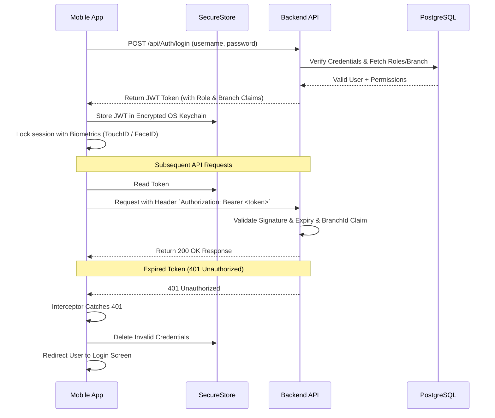

# MOBILE_SECURITY_MODEL.md — Enterprise Mobile Security Architecture

## 1. Executive Principles

1. **Server-Side Authorization Authority**: The mobile UI dynamically toggles tabs and screens based on user roles for user experience purposes only. All security enforcement, role checks, and permission validations are performed server-side on ASP.NET Core API endpoints.
2. **Branch Isolation Protection**: `BranchId` is resolved from JWT claims server-side via `ICurrentUserService`. The mobile client is never allowed to override branch boundaries on restricted data unless the authenticated user explicitly possesses cross-branch roles (`Owner`, `Admin`, `Accountant`).
3. **No Local Financial State**: The mobile client operates as a presentation and command layer. Calculations for installment schedules, penalty fees, balances, accounting journal entries, and receipt numbers are computed strictly server-side inside transactional database contexts.

---

## 2. Token & Session Lifecycle



---

## 3. Storage Security Matrix

| Asset | Storage Mechanism | Security Level | Purpose |
| :--- | :--- | :--- | :--- |
| **JWT Access Token** | Expo `SecureStore` | Hardware Encrypted (iOS Keychain / Android Keystore) | Auth Header for API calls |
| **User Role & Claims** | Zustand (In-Memory) | Non-Persistent In-Memory | Active UI module selection |
| **Biometric Opt-In** | Expo `SecureStore` | Hardware Encrypted | Local app unlock toggle |
| **Public Inventory Cache**| TanStack Query Cache | Temporary Disk Cache | Fast offline catalog preview |

> [!CAUTION]
> Sensitive tokens (JWT, Refresh Tokens, Customer ID Numbers) MUST NEVER be stored in unencrypted `AsyncStorage`.

---

## 4. Role-Based Access Control (RBAC) Hierarchy

```text
[Owner / Admin]
   └── Full access across all branches, executive analytics, profitability, AI insights, and approvals.

[Accountant]
   └── Full access to financial ledgers, cashboxes, accounting, purchases, and receipts across branches.

[Cashier]
   └── Branch-scoped installment payments, customer lookup, receipt issuance, and cash closing.

[Sales]
   └── Branch-scoped vehicle catalog, CRM leads, follow-ups, quotations, and contract creation.

[Customer]
   └── Restricted customer self-service access to ONLY their own vehicles, contracts, installments, and receipts.
```

---

## 5. Mobile AI Security Rules

1. **No Direct SQL / DB Access**: The AI Assistant interacts strictly via server-side business tools (`GetDashboardSummary`, `GetSalesSummary`, `SearchInventory`, etc.).
2. **Context & Role Forwarding**: Every AI request executes under the authenticated user's active HTTP context, inheriting their `UserId`, `Role`, and `BranchId`.
3. **Data Sanitization**: Sensitive financial facts or customer National IDs are masked before being passed to LLM presentation layers.
