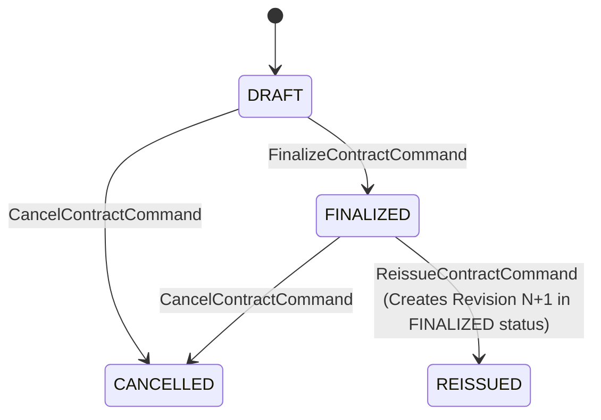

# FINAL APPROVED SALE DOCUMENT GAP ANALYSIS & DOMAIN ARCHITECTURE
**Project**: شركة الأصدقاء لتجارة السيارات — Vehicle Sale Receipt & Contract Module
**Document Reference**: `عقد / وصل بيع مركبة` (Official Vehicle Sale Document)
**Status**: FINAL APPROVED ARCHITECTURE (READY FOR MIGRATION & IMPLEMENTATION)
**Date**: 2026-08-03

---

## 1. Core Principles & Audit Baseline

This document defines the final, immutable domain architecture for generating, rendering, printing, and verifying official vehicle sale contracts and receipts (`عقد / وصل بيع مركبة` / `OFFICIAL VEHICLE SALE DOCUMENT`) for **شركة الأصدقاء لتجارة السيارات**.

### Architectural Directives:
1. **Reuse Existing Master Data**: Existing entities (`Vehicle`, `Customer`, `Supplier`, `User`, `Employee`, `Branch`, `Payment`, `InstallmentPlan`, `Purchase`) are preserved. No duplicate entities will be created.
2. **Immutable Snapshot + Reference Pattern**: Master data edits (e.g. customer phone changes, vehicle specification edits, or employee title updates) must **never** alter historical issued documents. Finalized contracts lock complete snapshots.
3. **Reissue over In-Place Edits**: Finalized contracts cannot be modified in place. Any revision produces a new document revision (`DocumentRevision + 1`) with a new unique `DocumentNumber` and `VerificationCode`, referencing the original `ReissuedFromDocumentId`.
4. **Distinct Identifiers**:
   - `ContractNumber`: Stable sale transaction identity (e.g., `SC-2026-000041`).
   - `DocumentNumber`: Unique versioned document identity (e.g., `SALE-2026-000041-R1`, `SALE-2026-000041-R2`).
   - `ReceiptNumber`: Payment receipt voucher identity (e.g., `REC-2026-000041`), present only when cash/downpayment receipts exist.

---

## 2. Updated Domain Specifications

### 2.1 Domain Enums (`CarShowroomManagementV2.Domain.Enums`)

```csharp
namespace CarShowroomManagementV2.Domain.Enums
{
    public enum VehicleOwnershipType
    {
        LEGACY_UNKNOWN = 0, // Used for historical rows where pre-sale ownership cannot be proven
        PERSON = 1,          // Owned by a private individual prior to sale
        SUPPLIER = 2,        // Sourced from / owned by a supplier
        COMPANY = 3          // Showroom inventory / registered under شركة الأصدقاء
    }

    public enum SaleDocumentStatus
    {
        DRAFT = 1,
        FINALIZED = 2,
        CANCELLED = 3,
        REISSUED = 4         // Historical document superseded by a reissued revision
    }
}
```

---

### 2.2 Domain Entity (`SalesContract.cs`)

```csharp
namespace CarShowroomManagementV2.Domain.Entities
{
    public class SalesContract : AuditableEntity
    {
        // ── 1. Document & Version Identity ──
        public string ContractNumber { get; set; } = string.Empty; // Transaction ID: SC-2026-000041
        public string DocumentNumber { get; set; } = string.Empty; // Document ID: SALE-2026-000041-R1 (Unique)
        public int DocumentRevision { get; set; } = 1;            // 1, 2, 3...
        public string? ReceiptNumber { get; set; }                 // REC-2026-000041 (Cash receipt ref)
        
        public SaleDocumentStatus DocumentStatus { get; set; } = SaleDocumentStatus.DRAFT;
        public bool IsFinalized => DocumentStatus == SaleDocumentStatus.FINALIZED;
        public string VerificationCode { get; set; } = string.Empty; // High-entropy unguessable token
        
        public DateTime SaleDate { get; set; } = DateTime.UtcNow;
        public DateTime? FinalizedAt { get; set; }
        public Guid? FinalizedByUserId { get; set; }
        public DateTime? CancelledAt { get; set; }
        public Guid? ReissuedFromDocumentId { get; set; }
        public virtual SalesContract? ReissuedFromDocument { get; set; }

        // ── 2. Buyer Reference & Snapshots ──
        public Guid CustomerId { get; set; }
        public virtual Customer? Customer { get; set; }
        public string? BuyerNameSnapshot { get; set; }
        public string? BuyerPhoneSnapshot { get; set; }
        public string? BuyerIdNumberSnapshot { get; set; }
        public string? BuyerAddressSnapshot { get; set; }
        public string? BuyerVatNumberSnapshot { get; set; }

        // ── 3. Vehicle Reference & Snapshots ──
        public Guid VehicleId { get; set; }
        public virtual Vehicle? Vehicle { get; set; }
        public string? VehicleBrandSnapshot { get; set; }
        public string? VehicleModelSnapshot { get; set; }
        public int? VehicleYearSnapshot { get; set; }
        public string? VehicleColorSnapshot { get; set; }
        public string? VinSnapshot { get; set; }           // Chassis # (LTR)
        public string? EngineNumberSnapshot { get; set; } // (LTR)
        public string? PlateNumberSnapshot { get; set; }  // (LTR)
        public string? ImportCountrySnapshot { get; set; }

        // ── 4. Pre-Sale Vehicle Ownership Model ──
        public VehicleOwnershipType OwnershipType { get; set; } = VehicleOwnershipType.PERSON;
        
        // PERSON Ownership (Reference & Snapshots)
        public Guid? OwnerPersonId { get; set; }
        public string? OwnerPersonNameSnapshot { get; set; }
        public string? OwnerPersonPhoneSnapshot { get; set; }
        public string? OwnerPersonIdNumberSnapshot { get; set; }
        public string? OwnerNotes { get; set; }

        // SUPPLIER Ownership (Reference & Snapshots)
        public Guid? SupplierId { get; set; }
        public virtual Supplier? Supplier { get; set; }
        public string? SupplierNameSnapshot { get; set; }
        public string? SupplierReference { get; set; }
        public DateTime? SupplyDate { get; set; }

        // COMPANY Ownership (Snapshots)
        public string? CompanyNameSnapshot { get; set; } // "شركة الأصدقاء لتجارة السيارات"
        public string? CompanyRegistrationReference { get; set; }

        // ── 5. Financial Snapshots ──
        public string Currency { get; set; } = "IQD";
        public decimal SalePrice { get; set; }
        public decimal TaxAmount { get; set; }
        public decimal RegistrationFees { get; set; }
        public decimal Discount { get; set; }
        public decimal NetPrice { get; set; } // FinalPrice
        public decimal DownPayment { get; set; }
        public decimal PaidAmountAtIssue { get; set; }
        public decimal RemainingAmountAtIssue { get; set; }
        public PaymentMethod PaymentMethod { get; set; }
        public decimal CostBasis { get; set; }
        public decimal Profit { get; set; }

        // Installment Specific Snapshots (when PaymentMethod == Installment)
        public int? InstallmentCountSnapshot { get; set; }
        public decimal? MonthlyInstallmentAmountSnapshot { get; set; }
        public DateTime? FirstDueDateSnapshot { get; set; }

        // ── 6. Staff Responsibilities & Security ──
        public Guid PreparedByUserId { get; set; } // Server authoritative context
        public virtual User? PreparedByUser { get; set; }
        public string? PreparedByNameSnapshot { get; set; }
        public string? PreparedByRoleSnapshot { get; set; }

        public Guid? SalesRepId { get; set; } // Salesperson (Employee)
        public virtual Employee? SalesRep { get; set; }
        public string? SalespersonNameSnapshot { get; set; }

        // ── 7. Terms Governance & Notes ──
        public string? TermsTemplateId { get; set; }
        public string? TermsTemplateVersion { get; set; }
        public string? TermsContentSnapshot { get; set; }
        public string? DocumentNotes { get; set; }

        // ── 8. Compliance & E-Invoicing ──
        public string? EInvoiceStatus { get; set; }
        public string? EInvoiceXmlHash { get; set; }
        public string? EInvoiceQrCode { get; set; }
        public string? EInvoiceUuid { get; set; }
        public string? EInvoiceError { get; set; }
        
        public virtual InstallmentPlan? InstallmentPlan { get; set; }
    }
}
```

---

## 3. Authoritative Workflow & Status State Machine

### Allowed Status Transitions:
* `DRAFT` ➔ `FINALIZED` (via `FinalizeContractCommand`)
* `DRAFT` ➔ `CANCELLED` (via `CancelContractCommand`)
* `FINALIZED` ➔ `CANCELLED` (via `CancelContractCommand`)
* `FINALIZED` ➔ `REISSUED` (via `ReissueContractCommand` ONLY)

Direct mutation of `DocumentStatus`, `IsFinalized`, or `DocumentRevision` from client DTO payloads is prohibited.



---

## 4. Reissue & Cancel Specifications

### 4.1 Reissue Workflow (`POST /api/contracts/{id}/reissue`)
- The original document (Revision `N`) transitions status to `REISSUED` (superseded) and remains immutable in the database.
- A new `SalesContract` entity row is created for Revision `N + 1`:
  - Inherits `ContractNumber` (e.g. `SC-2026-000041`).
  - Generates new `DocumentNumber` (e.g. `SALE-2026-000041-R2`).
  - Generates new `VerificationCode`.
  - Sets `DocumentRevision = N + 1`.
  - Sets `ReissuedFromDocumentId = OriginalDocument.Id`.
  - Captures new updated snapshots and transitions to `FINALIZED`.

### 4.2 Cancel Workflow (`POST /api/contracts/{id}/cancel`)
- Document transitions status to `CANCELLED` with `CancelledAt` timestamp.
- Remains queryable for internal audit.

### 4.3 Public Verification Response (`GET /api/contracts/verify/{code}`)
- **Active Finalized**:
  `{ "valid": true, "status": "FINALIZED", "documentNumber": "SALE-2026-000041-R1", "contractNumber": "SC-2026-000041", "revision": 1, "saleDate": "2026-08-03", "vehicleSummary": "تويوتا كامري 2024 (VIN: ***4589)", "buyerNameMasked": "ع. ح. م." }`
- **Superseded / Reissued**:
  `{ "valid": false, "status": "SUPERSEDED", "documentNumber": "SALE-2026-000041-R1", "contractNumber": "SC-2026-000041", "revision": 1, "replacementDocumentNumber": "SALE-2026-000041-R2" }` *(Replacement verification code is NOT exposed)*.
- **Cancelled**:
  `{ "valid": false, "status": "CANCELLED", "documentNumber": "SALE-2026-000041-R1", "contractNumber": "SC-2026-000041", "revision": 1 }`

---

## 5. Migration & Backfill Rules

1. Migration Name: `AddVehicleSaleContractRevisionsAndSnapshots`.
2. Existing Historical Records:
   - `OwnershipType` = `LEGACY_UNKNOWN` (`0`).
   - Historical snapshots populated ONLY from deterministic, unalterable fields. If unproven historically, left `null`. No silent fabrication of history from mutable master data.
3. Indexes & Constraints:
   - Unique index on `DocumentNumber`.
   - Unique index on `VerificationCode`.
   - Unique index on `(ContractNumber, DocumentRevision)`.
   - Indexes on `SupplierId`, `PreparedByUserId`, `DocumentStatus`, `OwnershipType`.

---

## 6. Pre-Migration Automated Test Suite (24 Test Cases)

1. `CreateContract_PersonOwnership_PopulatesPersonSnapshotsAndValidatesExclusivity`
2. `CreateContract_SupplierOwnership_PopulatesSupplierSnapshotsAndRequiresSupplierId`
3. `CreateContract_CompanyOwnership_PopulatesCompanySnapshotsAndNullsOtherOwners`
4. `CreateContract_InvalidMixedOwnership_ThrowsValidationException`
5. `CreateContract_ClientProvidesPreparedByUserId_IsOverriddenByAuthenticatedContext`
6. `FinalizeContract_MutatesCustomerEntityLater_DocumentDtoRemainsUnchanged`
7. `FinalizeContract_MutatesSupplierEntityLater_DocumentDtoRemainsUnchanged`
8. `FinalizeContract_MutatesVehicleEntityLater_DocumentDtoRemainsUnchanged`
9. `FinalizeContract_MutatesTermsTemplateLater_DocumentDtoRemainsUnchanged`
10. `FinalizedContract_DirectUpdateAttempt_ThrowsImmutabilityException`
11. `Reissue_FinalizedDocument_CreatesNewDocumentWithoutMutatingOriginal`
12. `Reissue_GeneratesNewDocumentNumberAndVerificationCode`
13. `Reissue_IncrementsDocumentRevision`
14. `CancelContract_SetsCancelledStatusAndPreservesAudit`
15. `PublicVerifyEndpoint_ValidCode_ReturnsMaskedMinimalData`
16. `PublicVerifyEndpoint_SupersededDocument_ReturnsReissuedStatusAndReplacementDocNum`
17. `PublicVerifyEndpoint_CancelledDocument_ReturnsCancelledStatus`
18. `PublicVerifyEndpoint_InvalidCode_ReturnsNotFound`
19. `DocumentNumber_DuplicateInsert_TriggersUniqueConstraintException`
20. `VerificationCode_DuplicateInsert_TriggersUniqueConstraintException`
21. `ContractNumberAndRevision_DuplicateInsert_TriggersUniqueConstraintException`
22. `ClientCannotDirectlySetFinalizedStatus`
23. `ClientCannotChangeDocumentRevision`
24. `RenderDocument_DraftStatus_DisplaysDraftWatermark_FinalizedOmitsWatermark`
