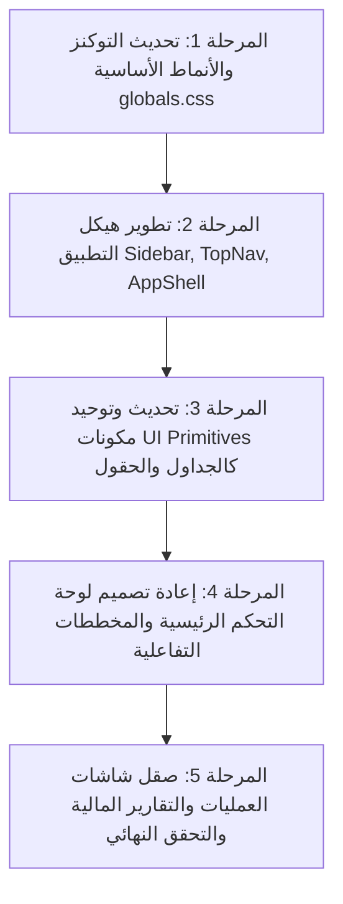

# خطة إعادة بناء الواجهة الأمامية وتحديث التصميم (V2 Frontend Rebuild Plan)

تحدد هذه الخطة تسلسل التعديلات البرمجية للملفات المعنية لتحقيق التحول الكامل إلى واجهة فاخرة من المستوى الأول.

---

## 1. الملفات المحددة للتعديل (Target Files & Components)

### أ. ملفات التوكنز والأسلوب العام (Base Style Files)
1. **[design-tokens.ts](file:///d:/System/car_showroom_management/v2-enterprise/frontend/src/styles/design-tokens.ts)**:
   * تحديث ثوابت نظام الألوان لدعم لوحة الألوان الجديدة المضيئة أولاً وتنسيق الهوامش والمسافات والظلال.
2. **[globals.css](file:///d:/System/car_showroom_management/v2-enterprise/frontend/src/styles/globals.css)**:
   * ضبط فئات التنسيق لـ Tailwind ومطابقة متغيرات الـ CSS لكل من ثيم الضوء والظلام.
   * إدراج مؤثرات الزجاج والظلال الطبقية وتدرجات الألوان.

### ب. هيكل التطبيق وقوالب التخطيط (App Layout Shell)
1. **[AppShell.tsx](file:///d:/System/car_showroom_management/v2-enterprise/frontend/src/components/layout/AppShell.tsx)**:
   * ضبط انتقالات الفتح والإغلاق للحاوية الجانبية وتحسين تمويه خلفيات القوائم في شاشات الجوال والشاشات الكبيرة.
2. **[Sidebar.tsx](file:///d:/System/car_showroom_management/v2-enterprise/frontend/src/components/layout/Sidebar.tsx)**:
   * تحديث تصميم شريط الجانب بالكامل: تنظيم المجموعات لتشابه أسلوب Linear، وإضافة حواف مضيئة وتأثيرات ارتدادية سلسة (Spring animations).
3. **[TopNav.tsx](file:///d:/System/car_showroom_management/v2-enterprise/frontend/src/components/layout/TopNav.tsx)**:
   * تحسين أداة اختيار الفروع الحالية، وتطوير شريط البحث ليظهر كصندوق حواري تفاعلي.

### ج. لوحة التحكم والقطع التفاعلية (Dashboard Widgets & Dashboard Page)
1. **[page.jsx](file:///d:/System/car_showroom_management/v2-enterprise/frontend/src/app/page.jsx)**:
   * إعادة تصميم الهيكل الشبكي وترتيب القطع (Widgets) ليتناسب مع شاشات القادة والمديرين الماليين.
2. **عناصر لوحة التحكم في `components/dashboard`**:
   * **[RevenueChartWidget.tsx](file:///d:/System/car_showroom_management/v2-enterprise/frontend/src/components/dashboard/RevenueChartWidget.tsx)** و **[FinancialChartWidget.tsx](file:///d:/System/car_showroom_management/v2-enterprise/frontend/src/components/dashboard/FinancialChartWidget.tsx)**: إعادة هيكلة الرسوم البيانية لتستخدم ظلالاً متوهجة خفيفة وتلميحات أدوات (Tooltips) مصممة خصيصاً وبألوان موحدة.
   * **[KpiCards.tsx](file:///d:/System/car_showroom_management/v2-enterprise/frontend/src/components/dashboard/KpiCards.tsx)**: تجميل الكروت وعرض النسب المالية وأسهم النمو بشكل أكثر جاذبية.

### د. المكونات المشتركة وحقول الإدخال (UI Primitives)
1. **مكونات مجلد `components/ui`**:
   * **[button.tsx](file:///d:/System/car_showroom_management/v2-enterprise/frontend/src/components/ui/button.tsx)**: تحسين التأثيرات اللمسية وتأثير الضغط.
   * **[input.tsx](file:///d:/System/car_showroom_management/v2-enterprise/frontend/src/components/ui/input.tsx)** و **[select.tsx](file:///d:/System/car_showroom_management/v2-enterprise/frontend/src/components/ui/select.tsx)**: إدراج الحدود المضيئة المتدرجة المتغيرة مع حالة الحقل.
   * **[table.tsx](file:///d:/System/car_showroom_management/v2-enterprise/frontend/src/components/ui/table.tsx)**: ضمان ثبات الأعمدة وعدم التفاف السطور وإضافة ألوان تباين دقيقة للسطور الفردية والزوجية.

---

## 2. ترتيب أولويات التنفيذ (Priority Order & Stages)

---

## 3. النتائج البصرية المتوقعة (Expected Visual Outcome)

* **انطباع الاستخدام الأول**: يشعر المستخدم فور دخوله إلى النظام بأنه يستخدم منتجاً SaaS عالمياً فاخراً ومصمماً بعناية فائقة.
* **راحة البصر وتماسك التصميم**: ثبات كلي لأبعاد الهوامش والمسافات، واستخدام خطوط أنيقة وقراءة ممتازة للأرقام والعملات بفضل تفعيل خاصية الأرقام الجدولية.
* **تفاعل حي وممتع**: استجابة فورية وحيوية لكل نقرة أو تمرير للمؤشر بفضل نظام الحركات المصغرة السلسة، مما يعزز إنتاجية الموظفين ويرفع من قيمة ومصداقية النظام كمنصة ERP مؤسسية فاخرة.
